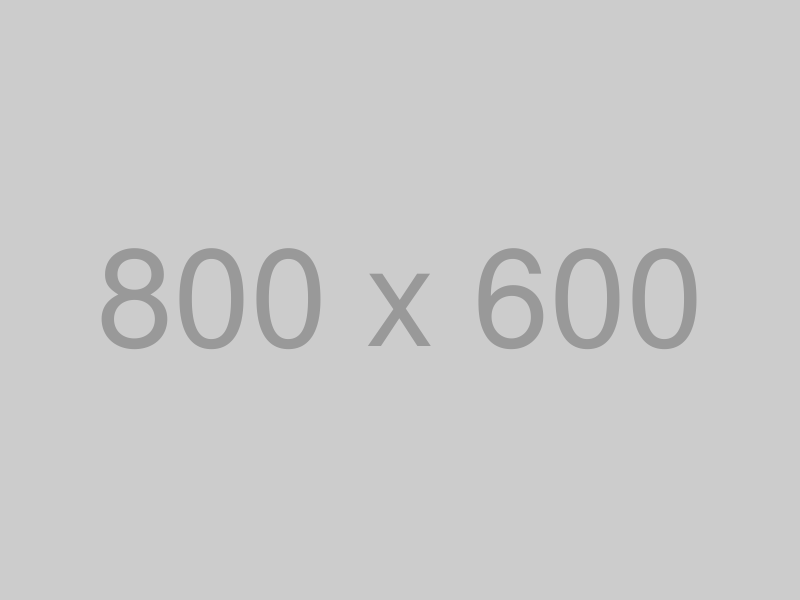
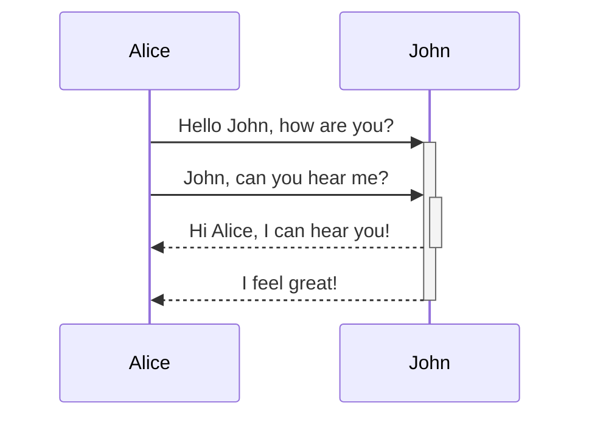
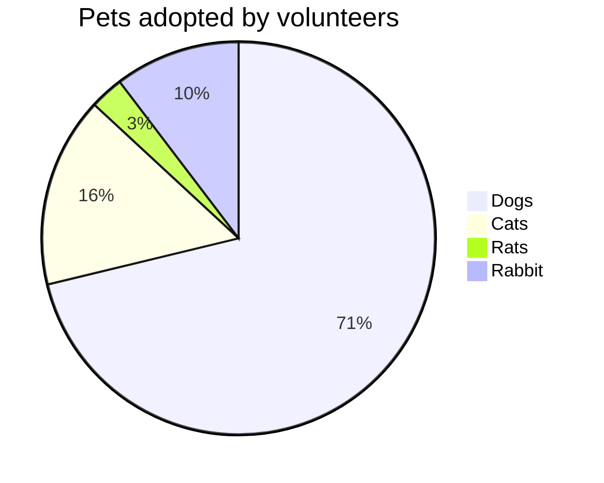

# [Playground]()

⚠️ I use this file as a <u>**PLAYGROUND**</u>

In [publishing](https://www.wikiwand.com/en/Publishing) and [graphic design](https://www.wikiwand.com/en/Graphic_design), **lorem ipsum** (derived from Latin *dolorem ipsum*, translated as "pain itself") is a [filler text](https://www.wikiwand.com/en/Filler_text) commonly used to demonstrate the graphic elements of a document or visual presentation w. 造没全径 [^1]

<ruby>大<rt>da</rt></ruby><ruby>学<rt>xue</rt></ruby>能夠**重点<u>加</u>粗 strong**，<u>下划线 underlinging</u>，然後意志纔<mark>高光 Mark</mark>；意志有了定力，然後~~删除线 del~~，不會<!--注释 前端看不到-->；能做到*斜体 italic*，然後<ruby>纔<rt>才</rt></ruby>能[超链接 Link](http://g.cn)隨遇而安；能夠 `代码 Code`，然後纔能處事精當思慮周詳；能夠思慮周詳，纔能得到至善的境界。

<ruby>大<rt>da</rt></ruby><ruby>学<rt>xue</rt></ruby>第一章是綱要所在， 所講訴的是==**三綱領**==與<u>八條目</u>的連貫性：

-   由個人「<u>**明明德**</u>」（<u>格物</u>，<u>致知</u>，<u>誠意</u>，<u>正心</u>，<u>修身</u>）做起；
-   發揮到「<u>**<ruby>親<rt>新</rt></ruby>民**</u>」（<u>齊家</u>，<u>治國</u>，<u>平天下</u>）[^2]；
-   以達到「<u>**止於至善**</u>」的境地。

[^2]:	「親民」是使民眾能日新月異，進步不已，革新民意。

能夠**重点加粗 strong 重点加粗 strong 重点加粗 strong 重点加粗 strong 重点加粗 strong**，<u>下划线 underlinging 下**划**线 **underlinging** 下划线 underlinging</u>，然後<u>**加粗又下划**</u>意志纔<mark>高光 Mark 高光 Mark <u>高光 Mark</u> 高光 Mark 高光 Mark 高光 Mark 高光 Mark 高光 Mark 高光 Mark 高光 Mark</mark>；意志有了定力，然後~~删除线 del 删除线 del 删除线 del 删除线 del 删除线 del 删除线 del 删除线 del 删除线 del 删除线 del 删除线 del 删除线 del 删除线 del~~，不會<!--妄動-->；能做到*斜体 italic 斜体 italic 斜体 italic 斜体 italic 斜体 italic 斜体 italic 斜体 italic 斜体 italic 斜体 italic 斜体 italic*，然後纔能[超链接 Link 超链接 Link 超链接 Link 超链接 Link 超链接 Link 超链接 Link 超链接 Link 超链接 Link 超链接 Link 超链接 Link 超链接 Link](http://g.cn)隨遇而安；能夠`代码 Code 代码 Code 代码 Code 代码 Code 代码 Code 代码 Code 代码 Code 代码 Code 代码 Code 代码 Code 代码 Code 代码 Code`，然後纔能處事精當思慮周詳；能夠思慮周詳，纔能得到至善的境界。

<q>q 行内引用 淡化 注释</q>

在 Finder 里面直接按 <kbd>⌘⇧.</kbd> （<kbd>Cmd</kbd>+<kbd>Shift</kbd>+<kbd>.</kbd>）即可切换隐藏文件显示与隐藏。

## Title 1

### Title Level 2

#### Title Level 3

-   <u>Automatic</u> numbering
-   Distinguish the <u>current level</u>
-   Numbering H2 in <u>outline</u> panel
-   Add <u>horizontal line</u> above H2 level

### Title Level 2

## Title 2 大學之道

<span style="font-size:48px;font-weight:700">誠實精進 <ruby>Bold<rt>700</rt></ruby> *<ruby>600<rt>use</rt></ruby> / 48*</span>
<span style="font-size:48px;font-weight:400">誠實精進 Normal *400*</span>
<span style="font-size:24px;font-weight:700">誠實精進 Bold *600 / 24*</span>
<span style="font-size:24px;font-weight:400">誠實精進 Normal *400*</span>
<span style="font-size:16px;font-weight:700">誠實精進 Bold *600 / 16*</span>
<span style="font-size:16px;font-weight:400">誠實精進 Normal *400*</span>


A common form of *lorem ipsum* reads:

> Lorem ipsum dolor sit amet, consectetur adipiscing elit, sed do eiusmod tempor incididunt ut labore et dolore magna aliqua. Ut enim ad minim veniam, quis nostrud exercitation ullamco laboris nisi ut aliquip ex ea commodo consequat.
>
> Duis aute irure dolor in reprehenderit in voluptate velit esse cillum dolore eu fugiat nulla pariatur. Excepteur sint occaecat cupidatat non proident, sunt in culpa qui officia deserunt mollit anim id est laborum.

---

Inline styles support **strong**, _Emphasis_, `code`, <u>underlinging</u>, ~~strikethrough~~, :haha:, $\LaTeX$, X^2^, H~2~O, ==highlight==, [Link](typora.io), and image:




Block level contains:

### Heading 3 在明明德

造没全径

#### Heading 4 在日新

造没全径

造没全径

##### Heading 5 在止于至善

造没全径

###### Heading 6

造没全径 又日新

| Left-Aligned | Center Aligned | Right Aligned |
| :----------- | :------------: | ------------: |
| Number is    |   monospace    |        \$1600 |
| Has a hidden |  `dark` theme  |          \$12 |
| Banned       |      rows      |           \$1 |

1. ordered [list](#) item 1.
2. ordered list item 2.
3. ordered list item
4. ordered list item
5. ordered list item
6. ordered list item
7. ordered list item
8. ordered list item
9. ordered list item
10. ordered list item ordered list item ordered list item ordered list item ordered list item ordered list item ordered list item ordered list item ordered list item ordered list item

-   ul
-   ulordered list item ordered list item ordered list item ordered list item ordered list item ordered list item ordered list item
    -   sub-unordered list item 1.
        sub-unordered list item 1. line 2.
    -   sub-unordered list item 2.
        -   [x] something is DONE.
            -   [x] sub todo.
            -   [ ] sub todo.
        -   [ ] ordered list item ordered list item ordered list item ordered list item ordered list item ordered list item something is not TODO.

```html
<!DOCTYPE html>
<html>
    <body>
        <h1>The *= Operator</h1>

        <p id="demo"></p>

        <script>
            var x = 10;
            x *= 5;
            document.getElementById("demo").innerHTML = x;
        </script>
    </body>
</html>
```
```python
def add(*arg):
    return sum(arg)
print(f'{add(1,2,3)}')
```
```bash
echo "abc" >> abc.txt
```






[TOC]

[^1]: _Forked_ from https://en.wikipedia.org/wiki/Lorem_ipsum
