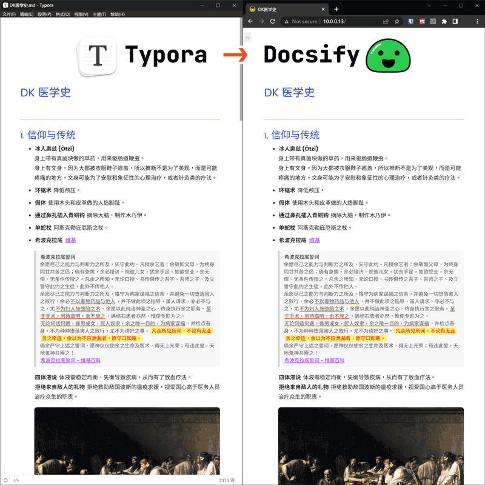
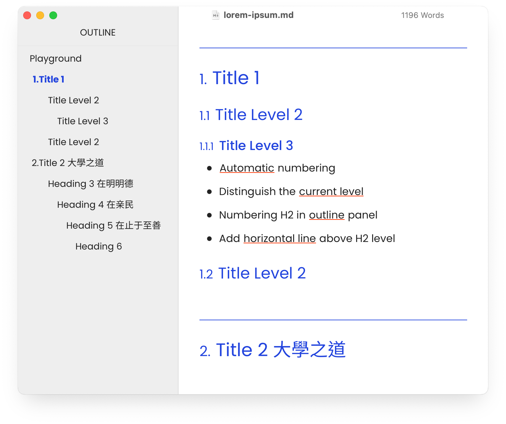
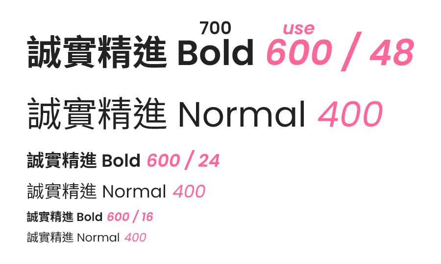

# Typora + Docsify

A theme that present <u>same style</u> in Typora and Docsify.

I usually write in [Typora](https://typora.io/) and then use [Docsify](https://docsify.js.org) display md as a web page, so I wanted the markdown will looks simillar in both platform, and I wrote this theme.

**What U See** in Typora **is What U Get** in Docsify.

> 这是一个主题，可以在 Typora 和 Docsify 呈现同样的样式。
>
> 我平时使用 [Typora](https://typora.io/) 写作，然后用 [Docsify](https://docsify.js.org) 作为网页发布，所以我希望 Typora 和 Docsify 对同一篇 md 有**一致的呈现**，于是写了这个主题。



## Installation 安装

First of All, download the release zip file on [this page](https://github.com/Erimus-Koo/theme_typora_docsify/releases).

> 先下载从 [这个页面](https://github.com/Erimus-Koo/theme_typora_docsify/releases)下载压缩文件。

### in Typora

Open `Preferences / Apperance / Open Theme Folder`
Just unzip the `typora-docsify.css` file and `typora-docsify` folder into the Typora theme folder.

> 前往 `偏好设置 / 外观 / 打开主题文件夹`，然后将上述文件夹内的文件解压缩到该目录内。

```
// Finally your file looks like this
// 解压后大致如下

 {Your Typora Theme Path}
 │
 ├──typora-docsify.css    <- theme file
 │
 ├── typora-docsify
 │  ├──codeblock.css      <- highlights in code block
 │  └──theme-simple.css   <- docsify basic style
 │
 └──{other theme files...}
```

### in Docsify

If you use this theme in <u>Docsify</u>, you need import `theme-simple.css` as default theme, my theme is base on it. Add this to your `<head>` block.

> 在 Docsify 中使用本主题，需要先导入一个 `theme-simple.css`，我是基于这个基础再修改的。在 `<head>` 中加入以下代码即可。

```html
<link
  rel="stylesheet"
  href="{your-docsify-path}/typora-docsify/theme-simple.css"
/>
<link rel="stylesheet" href="{your-docsify-path}/typora-docsify.css" />
```

I use and **modify** this theme in my Docsify CSS folder, so I make a soft link to the Typora theme folder (Use `Mklink` in Windows or `ln` in Mac), then you can modify one of them and update both.

### Chinese Font

如果你使用中文写作，非常推荐你安装 [思源黑体](https://github.com/adobe-fonts/source-han-sans/releases)。

## Features 功能特色

### Numbering for Header 标题编号

I prefer to use an <u>outline</u> for my writing so that the structure is clear and helps clarify my thoughts, so I have added _auto numbering_ for the headings.

Starts with `H2`, because I use `H1` as <u>TITLE</u>.

> 我偏好使用大纲来写作，这样结构清晰有助于厘清思路，所以我给各级标题添加了自动编号功能。我习惯用 H1 作为文章标题，所以是从 H2 层级开始自动计数。



### Fonts 字体

Since I mostly write in Chinese, I wanted to find an English font that would fit Chinese and well matched, that means:

- Simillar font weight (stroke width)
- Big x-height and width to fit the Chinese character
- Looks beautiful

Finally I chose [Poppins](https://fonts.google.com/specimen/Poppins) <q>(Similar to Futura)</q> and import online from Google Fonts. There's a tricky use Poppins 600 instead of 700, which looks better.

The monospace I chose [JetBrains Mono](https://fonts.google.com/specimen/JetBrains+Mono).

> 因为平时大多使用中文写作，所以希望找一个适配中文且美观的英文字体，所以我选择了 Poppins（类似 Futura），并且通过 Google Fonts 载入。如果你无法直接访问 Google，可先自行下载。等宽用的 JetBrains Mono。
>
> 中文字体使用了思源黑体的港版 Source Han Sans HC，因为字体太大所以*并不附在主题中*，如果你需要用到中文，可以自行到 [这里](https://github.com/adobe-fonts/source-han-sans/releases) 下载。当然即便没有<u>思源</u>，本主题还是会自动回退到<u>苹方</u>、<u>微软雅黑</u>之类系统自带的中文字体。



### Reading Experience 阅读优化

- Less words per line, for better reading experience.
- Easy to annotation, use **BOLD**, <u>underline</u>, _emphasis/italic_, ==mark/highlight==, ==<u>mark underline</u>==, <q>inline quote</q>, ~~delete~~, [🔗link](#), etc.

> 作为设计师，会比较关注一些跟阅读体验有关的细节：
>
> - 每行宽度大约在 40 个字，避免单行过长而难以转到下一行的行首。
> - 多种高光标注方式，便于找到重点。比如：**加粗**，<u>下划线</u><u>连续下划线加间隔</u>便于标注<u>连续</u><u>术语</u>，_em 斜体加重加染色_，==高光 mark==，等。

### Others 其它

- Add round corner to image / code block / table.
- Image height limit to 80% of viewport, prevent mobile screenshot looks too big. <q>(You can use customized CSS to display long image)</q>
- Use monospace in table, the number will looks better.
- Transitions and hover effect.

> - 图片、代码框、表格加圆角。
> - 图片高度限制，避免手机截图之类的图过大，限制了图片最大高度 80% 视窗。（可以通过 CSS 解除该限制）
> - 表格默认等宽字体，我用来写代码和数字比较多，等宽字体更好阅读。
> - 引用都是淡化显示不喧宾夺主，但鼠标移入时加深更便于阅读。
> - 鼠标移入变化都带了 transition。


## About

This theme is wrote by <u>LESS</u>, the main file is `typora-docsify.less`. And generate `.css` file by [less2css](https://packagecontrol.io/packages/Less2Css)(a <u>Sublime Text</u> package).
